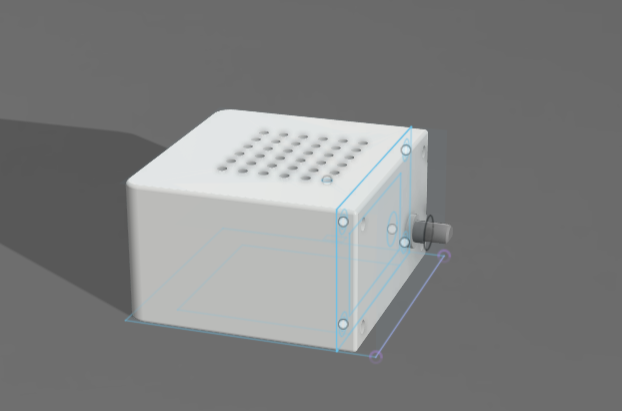
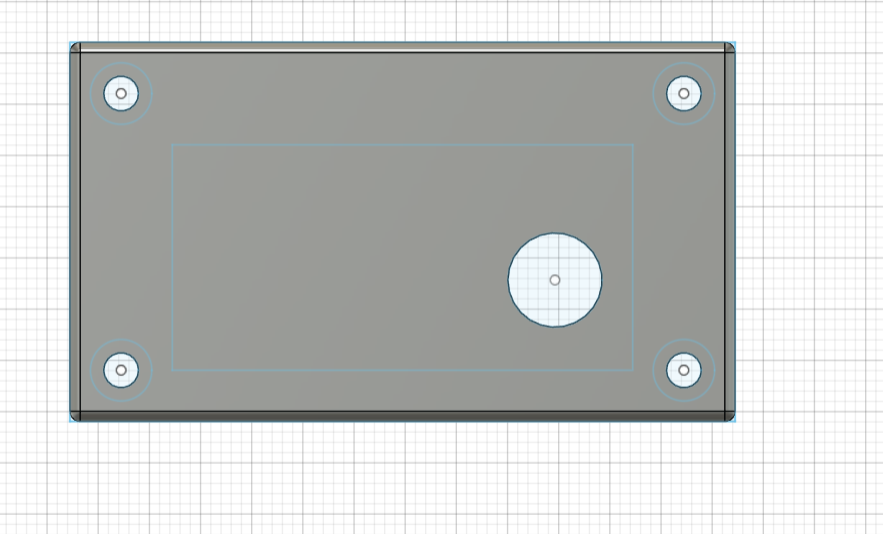
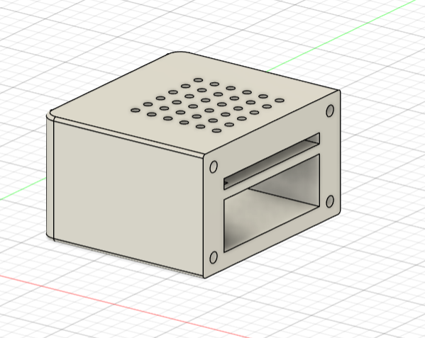
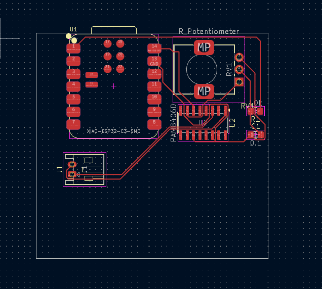
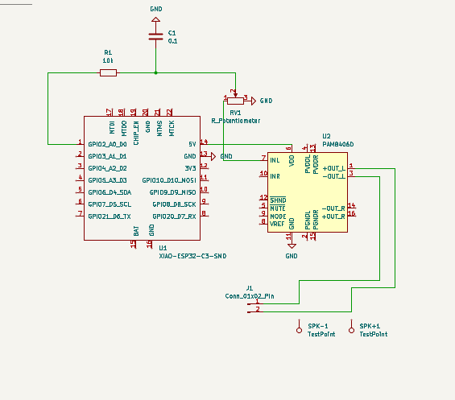

# White Noise Machine (ESP32 + PAM8406D)

A very simple white noise generator using an ESP32 (XIAO ESP32-C3) and a PAM8406D audio amplifier.

---

## Overview

- MCU generates pseudo-random noise using PWM  
- RC filter smooths the signal  
- PAM8406D amplifies the audio  
- Volume controlled with a potentiometer  
- Output to an external speaker  

---

## Enclosure

  

---

## PCB

---

## Schematic

---

## BOM

| Qty | Component | Value / Part |
|---|---|---|
| 1 | MCU | XIAO ESP32-C3 SMD |
| 1 | Audio Amp | PAM8406D (SOIC-16) |
| 1 | Resistor | 10 kΩ |
| 1 | Capacitor | 0.1 µF |
| 1 | Potentiometer | 10 kΩ (Volume) |
| 1 | Speaker | 4–8 Ω, 0.5–3 W |
| 1 | Connector | 2-pin jst connector |
| 4 | Screw | M3x10mm |

---

